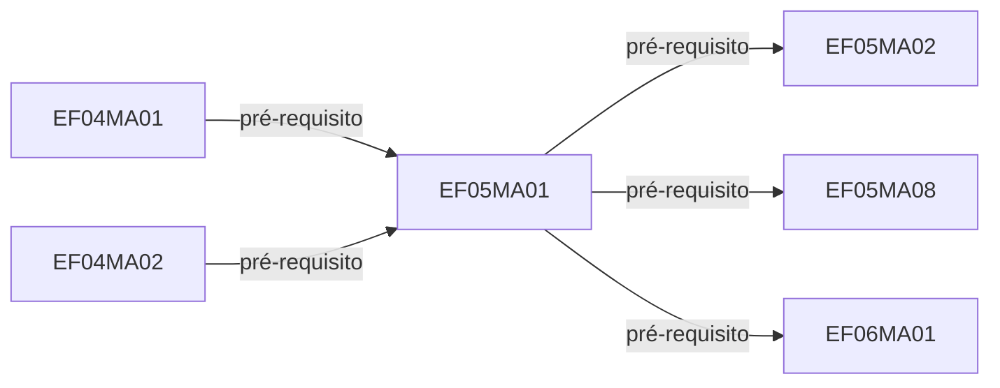

> **Atualização de 18/09/2026:** as 520 habilidades válidas anteriormente sem ficha foram completadas com a BNCC oficial; três códigos inconsistentes têm ficha de revisão. Todos os 946 códigos possuem registro. Consulte a [complementação e suas referências](Complementacao_BNCC.md). O relatório abaixo documenta a extração original da planilha, anterior a esta complementação.

# BNCC Foco — análise e modelo de grafo

## Conclusão

É viável transformar a planilha em um grafo navegável. A unidade principal deve ser **um código de habilidade por nota**, com relações tipadas e evidências por aba e célula. Um único Markdown funciona como relatório e porta de entrada; para o grafo nativo do Obsidian, a entrega deve conter várias notas interligadas.

O grafo global ajuda a reconhecer conjuntos. Para planejamento pedagógico, a visualização mais informativa é **habilidade selecionada → suas bases → seus dependentes**, com complementares em uma camada separada. A imagem de referência ilustra bem o risco de mostrar todos os vínculos de uma vez: perde-se o significado de cada linha.

## Cobertura efetivamente extraída

| Medida | Resultado |
|---|---:|
| Abas, incluindo apresentações, orientações, sínteses e créditos | 59 |
| Células preenchidas preservadas | 5832 |
| Abas com fichas detalhadas | 39 |
| Registros de fichas — antes de reunir códigos repetidos | 471 |
| Códigos distintos | 946 |
| Códigos com ficha própria | 423 |
| Códigos somente citados, sem ficha própria | 523 |
| Códigos com AF ou AF/AC na própria ficha | 409 |
| Pares dirigidos de pré-requisito | 589 |
| Pares dirigidos de relações da coluna H | 1836 |
| Pares de relações nas matrizes de visão geral | 389 |
| Pares de menções em comentários — sem inferir dependência | 253 |

As relações são deduplicadas por origem, destino e tipo. Evidências repetidas são reunidas na mesma aresta. Relações da visão geral podem repetir relações da ficha; os totais por tipo não equivalem a pares únicos de códigos. Existem 884 códigos do Ensino Fundamental, 53 do Ensino Médio e 9 objetivos da Educação Infantil. As fichas próprias são de Ensino Fundamental; EI e EM são referências, não mapas completos dessas etapas.

| Componente | Códigos com ficha própria |
|---|---:|
| Língua Portuguesa | 154 |
| Matemática | 123 |
| Ciências | 56 |
| Geografia | 53 |
| História | 37 |

## Como as próprias abas definem as relações

As orientações em caixas de texto foram extraídas, além das células. Foram tratadas como explicações do documento, não como instruções operacionais dirigidas ao assistente.

| Conteúdo | Interpretação | Representação |
|---|---|---|
| A: campo de atuação ou unidade temática | Contexto curricular | Metadado e índice temático; não vira pré-requisito |
| B: conhecimento prévio | O que o estudante precisa desenvolver antes; pode ser do mesmo ano | Aresta `base → dependente` |
| C: código | Identidade da habilidade | Chave única; múltiplas ocorrências mantidas |
| D: texto da habilidade | Enunciado fornecido na fonte | Texto integral em cada registro |
| E: classificação | AF, AC, EF ou combinação contextual | Valor original por registro; filtro de foco baseado na própria ficha |
| F: objetivos | Desdobramentos didáticos | Texto e formatação; não são novas habilidades BNCC |
| G: competências | Vínculos CG, CA, CE | Texto original, identificadores e índices com escopo |
| H: relacionadas | Complementam ou podem ser desenvolvidas junto à focal | Aresta de associação; nunca pré-requisito automático |
| I ou J: comentários | Orientações didáticas e justificativas | Texto integral; códigos citados como menções, sem inferência causal |
| I em três abas de 9º ano | Habilidades do EM das quais a habilidade se torna conhecimento prévio | Aresta do EF para o EM; comentários deslocados para J |

Nas orientações de LP, H admite AF, AC e EF. Nas de Matemática e Ciências, enfatiza aprendizagens complementares. Em Ciências Humanas, admite AF e AC. O importador não impõe a mesma classificação a todas as áreas.

Em Matemática, o negrito nos objetivos tem significado: identifica expectativas de fluência associadas à aprendizagem focal. A formatação foi preservada nas notas Markdown e nas sequências de texto do arquivo de células. Não se criou um código novo para cada trecho em negrito. O explorador mostra esse destaque também.

As competências não devem se misturar apenas pelo número: CG 1 é geral; CE 1 precisa do componente; CA 1 precisa da área. Compartilhar competência é uma conexão por contexto, não prova de dependência. Os índices correspondentes oferecem essa navegação sem sobrecarregar o grafo inicial.

## Relações entre componentes, áreas e etapas

Há 62 relações dirigidas entre História e Geografia na coluna H. Elas conectam componentes de **Ciências Humanas**, não duas áreas diferentes. As matrizes de visão geral também contêm 62 relações entre esses componentes.

Entre os pré-requisitos, foi identificada a ponte explícita **EF05MA12 → EF06GE08**, em `6 ano CH!B12`, conectando Matemática e Geografia. Há ainda 21 ligações de objetivos da Educação Infantil para habilidades de Ciências Humanas e 79 ligações do Ensino Fundamental para o Ensino Médio. Transição de etapa deve ser distinguida de interdisciplinaridade.

Não há sustentação nesta planilha para inventar uma rede densa entre todas as áreas. Relações temáticas adicionais podem ser propostas numa segunda camada de curadoria, identificadas como sugestões e separadas das relações declaradas.

## Exemplo real: sistema de numeração

Evidências: `5º ano MT!B3`, `5º ano MT!B4`, `5º ano MT!B9` e `6 ano MT!B3`. O encadeamento vem de referências explícitas, não da ordem numérica dos códigos.

## Visões recomendadas e implementação entregue

1. **Vizinhança local:** selecione uma habilidade e veja pré-requisitos à esquerda, dependentes à direita e relacionadas no grupo central. Clique para navegar. Entregue no explorador offline.
2. **Cadeia de dependência:** expanda até três etapas. Só pré-requisitos são percorridos na expansão; associações não entram no caminho. O recorte visual tem limite de 110 nós, informado na tela.
3. **Visão por ano e componente:** matriz de quantidades e filtros. Códigos como EF15LP14 pertencem a uma faixa de anos; a presença em múltiplas colunas não multiplica a habilidade.
4. **Visão temática e por competência:** índices Markdown com links para os códigos. Campos e temas foram mantidos como contexto, sem transformar proximidade em obrigação curricular.
5. **Grafo geral:** disponível no Obsidian e via GraphML. Use-o para orientação ampla e depois aproxime o recorte. As tipagens de arestas estão no GraphML/JSON; no Obsidian nativo, o tipo é explicado nas notas.

Os nós EI representam objetivos de aprendizagem em campos de experiências. O grupo 03 não significa 3º ano. A interpretação dos códigos foi conferida na [BNCC oficial, estrutura da Educação Infantil](https://basenacionalcomum.mec.gov.br/images/BNCC_EI_EF_110518_versaofinal_site.pdf). A sigla EF dentro de um código EI corresponde ao campo Escuta, fala, pensamento e imaginação.

## Diferenças, lacunas e revisão pedagógica

- **523 códigos sem ficha própria:** mantidos como nós de referência, sinalizados. Não se buscaram nem se inventaram seus enunciados.
- **11 ocorrências de códigos suspeitos em células:** exemplos EF07P12, EF67LP006, EF8929, EF09LP014, EFMA01MA04 e EF0AMA18. Também foi sinalizado EF05GE08e. Não foram corrigidos automaticamente nem utilizados como códigos válidos de arestas.
- **Uma célula de competências anômala:** `9º ano LP!G10` repete objetivos de produção de reportagem em vez de identificadores de competências. O conteúdo foi preservado.
- **Cinco códigos com diferenças de enunciado entre registros:** EF67LP08, EF67LP09, EF89LP08, EF67LP11 e EF89LP19. As versões ficam em suas respectivas fichas; o primeiro enunciado é usado como resumo no explorador, sem eleger uma correção oficial.
- **Duplicações legítimas:** o mesmo código aparece em mais de um ano. São 471 registros para 423 códigos com ficha; reuni-los não elimina seus contextos.
- **AF/AC contextual:** não foi reduzida à força para uma única categoria. Classificações recebidas da coluna H ficam separadas da própria classificação em E.
- **Progressões visuais:** as oito abas de síntese/progressão foram preservadas com posição, rótulos e mesclagens. As matrizes de CN e CH geram associações somente onde há coluna focal e colunas complementares na mesma linha. A proximidade em sequências de LP, MT ou nos blocos de progressão de CN não foi convertida em pré-requisito. Revisar manualmente eventuais relações implícitas na diagramação é uma etapa de curadoria, não uma extração inequívoca.
- **Não foram encontrados ciclos** na sub-rede de 589 pré-requisitos extraídos. Isso vale para a versão atual, com referências inválidas excluídas; não prova que todo o currículo seja uma sequência linear.
- Há inconsistências editoriais, como o título “ANOS INICIAIS” na aba `Visão geral - Anos Finais CN!C1`. Os valores originais foram preservados.
- Textos introdutórios externos estão ligados nas apresentações. Os endereços foram preservados; seus PDFs não foram incorporados à análise curricular. Imagens incorporadas foram conservadas, e o conteúdo gráfico não foi usado para adivinhar novas dependências.

## Arquivos entregues

- `BNCC_Analise_e_Modelo.md`: este relatório.
- `BNCC_Explorador.html`: visualização offline, sem instalação ou serviços externos; contém dados, filtros, relações e evidências.
- `BNCC_Obsidian.zip`: cofre de notas Markdown, fontes, índices e auditoria. Extraia e abra a pasta como cofre.
- `BNCC_Grafo.json`: nós, relações tipadas, contexto, registros e evidências.
- `BNCC_Grafo.graphml`: intercâmbio com ferramentas que aceitam GraphML. Relações de associação mantêm direção documental, não causal.
- `BNCC_Relacoes.csv`: origem, destino, tipo e evidência, para inspeção tabular.
- `BNCC_Celulas_e_Objetos.json`: preservação das células, sequências de formatação, mesclagens e objetos textuais.

Nenhum formato garante importação idêntica em toda plataforma. Markdown com wikilinks atende ao Obsidian; JSON, CSV e GraphML permitem adaptar os mesmos dados a outras ferramentas.

## Uso no Obsidian

Extraia o ZIP, abra `BNCC_Obsidian` como cofre e leia `00 - Comece aqui`. No grafo, filtre por `path:Habilidades` e agrupe por tags de componente. Comece no grafo local com profundidade 1. Ative setas, lembrando que associações e dependências têm significados diferentes mesmo que a linha nativa seja semelhante. A [documentação oficial do Obsidian](https://obsidian.md/help/plugins/graph) descreve grupos, filtros, setas e profundidade do grafo local.

Não se adicionaram links inversos só para navegação: isso confundiria a direção dos pré-requisitos. Relações recebidas são listadas em texto, e o explorador permite navegação clicável nos dois sentidos.

## Inventário das 59 abas

| Aba | Papel | Células preenchidas | Fichas |
|---|---|---:|---:|
| Língua Portuguesa | apresentação | 40 | 0 |
| Orientações gerais p leitura | orientações | 3 | 0 |
| Progressão - Anos iniciais LP | síntese e progressão | 174 | 0 |
| 1º ao 5º ano LP | mapa detalhado | 44 | 4 |
| 1º e 2º ano LP | mapa detalhado | 94 | 11 |
| 1º ano LP | mapa detalhado | 118 | 14 |
| 2º ano LP | mapa detalhado | 121 | 14 |
| 3º ao 5º ano LP | mapa detalhado | 108 | 12 |
| 3º ano LP | mapa detalhado | 114 | 13 |
| 4º ano LP | mapa detalhado | 134 | 15 |
| 5º ano LP | mapa detalhado | 115 | 13 |
| Progressão - Anos Finais LP | síntese e progressão | 113 | 0 |
| 6º ano LP | mapa detalhado | 233 | 28 |
| 7º ano LP | mapa detalhado | 215 | 28 |
| 8º ano LP | mapa detalhado | 206 | 25 |
| 9º ano LP | mapa detalhado | 231 | 25 |
| CRÉDITOS / FICHA TÉCNICA LP  | créditos | 44 | 0 |
| Matemática | apresentação | 34 | 0 |
| Orientações gerais para leitura | orientações | 3 | 0 |
| Visão Geral - Anos Iniciais MT | síntese e progressão | 92 | 0 |
| 1º ano MT | mapa detalhado | 82 | 9 |
| 2º ano MT | mapa detalhado | 106 | 12 |
| 3º ano MT | mapa detalhado | 123 | 14 |
| 4º ano MT | mapa detalhado | 124 | 14 |
| 5º ano MT | mapa detalhado | 115 | 13 |
| Visão Geral - Anos Finais MT | síntese e progressão | 89 | 0 |
| 6 ano MT | mapa detalhado | 144 | 17 |
| 7 ano MT | mapa detalhado | 148 | 18 |
| 8 ano MT | mapa detalhado | 118 | 14 |
| 9 ano MT | mapa detalhado | 118 | 12 |
| CRÉDITOS / FICHA TÉCNICA MT | créditos | 45 | 0 |
| Ciências da Natureza | apresentação | 34 | 0 |
| Orientações gerais p. leitura | orientações | 3 | 0 |
| Visão geral - Anos Iniciais CN | síntese e progressão | 97 | 0 |
| 1 ano CN | mapa detalhado | 43 | 4 |
| 2 ano CN | mapa detalhado | 55 | 5 |
| 3 ano CN  | mapa detalhado | 56 | 5 |
| 4 ano CN | mapa detalhado | 65 | 6 |
| 5 ano CN | mapa detalhado | 64 | 6 |
| Visão geral - Anos Finais CN | síntese e progressão | 118 | 0 |
| 6 ano CN | mapa detalhado | 79 | 8 |
| 7 ano CN  | mapa detalhado | 78 | 8 |
| 8 ano CN | mapa detalhado | 73 | 7 |
| 9 ano CN | mapa detalhado | 80 | 7 |
| CRÉDITOS / FICHA TÉCNICA  CN | créditos | 35 | 0 |
| Ciências Humanas | apresentação | 34 | 0 |
| Orientações gerais para leitur | orientações | 3 | 0 |
| Visão Geral - Anos Iniciais CH | síntese e progressão | 227 | 0 |
| 1 ano CH | mapa detalhado | 84 | 8 |
| 2 ano CH | mapa detalhado | 75 | 7 |
| 3 ano CH | mapa detalhado | 83 | 8 |
| 4 ano CH | mapa detalhado | 74 | 7 |
| 5 ano CH | mapa detalhado | 81 | 8 |
| Visão Geral -Anos Finais CH | síntese e progressão | 295 | 0 |
| 6 ano CH | mapa detalhado | 108 | 11 |
|  7 ano CH | mapa detalhado | 120 | 12 |
| 8 ano CH | mapa detalhado | 146 | 15 |
| 9 ano CH | mapa detalhado | 138 | 14 |
| CRÉDITOS / FICHA TÉCNICA CH | créditos | 36 | 0 |

## Rastreabilidade

Fonte: BNCC_Foco.xlsx. SHA-256: `5943ffd31191f45d441b67fe0417de2f8bece699bd792574663be9e41a853926`. A planilha original não foi alterada. Todos os vínculos gerados apontam para códigos existentes no conjunto de nós. Os enunciados, objetivos e comentários foram preservados por registro. Créditos de autoria constam nas abas de ficha técnica preservadas; os Mapas de Foco são identificados no material como iniciativa do Instituto Reúna, com realização do Instituto Reúna e Fundação Itaú Social.

## Verificação da entrega

Foram conferidos: totais de registros e nós, destinos de todas as arestas, unicidade por tipo de relação, resolução de todos os wikilinks, exemplos contra suas referências, separação dos campos da Educação Infantil, preservação dos registros repetidos, integridade do ZIP, leitura do GraphML e sintaxe do explorador. A conferência visual e de interação no navegador integrado não foi concluída: a abertura da prévia não respondeu e a abertura direta do arquivo local foi bloqueada pela política de URLs. O HTML é entregue com essa limitação de validação; os testes de dados passaram.
